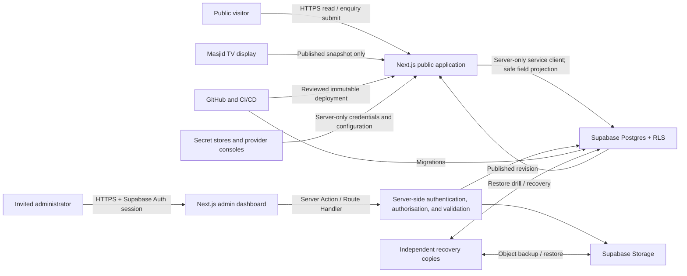

# Threat Model

## Document status

This is the threat model for the implemented Next.js and Supabase repository. Where it describes a
present route or database control, that is still not credentialed evidence that the control works in
staging or production. Deployment-dependent status follows [SECURITY.md](../../SECURITY.md) and the
launch checklist.

Release-candidate evidence is tracked in the [QA report](../quality/QA-REPORT.md),
[database P1 validation](../quality/DATABASE-P1-VALIDATION.md) and
[operational workflow validation](../quality/OPERATIONAL-WORKFLOW-VALIDATION.md). Those reports
distinguish an executed local check from a pending GitHub Actions, Supabase, browser or provider
check.

Review this document before launch, after an architecture or provider change, after adding a new
data category, and after a significant incident. The review owner and date must be recorded in the
production readiness checklist rather than invented here.

## Scope

In scope:

- the public Next.js application, cached and server-rendered output, Route Handlers, and Server
  Actions;
- the invite-only administration dashboard;
- Supabase Postgres, Auth, Storage, database functions, triggers, and RLS policies;
- prayer calculation, congregation rules, Jumu'ah sessions, overrides, publication, and TV display
  delivery;
- announcements, events, pages, policies, media, and emergency notices;
- enquiry submission, review, response metadata, retention, and deletion;
- GitHub, dependency registries, CI/CD, hosting, DNS, email delivery, monitoring, backups, and
  administrator devices.

Out of scope but trusted only through contracts and configuration:

- the security of visitors' browsers, email accounts, telephone networks, WhatsApp, social networks,
  and map providers;
- the accuracy of committee decisions supplied to the system;
- physical access to the masjid TV device and committee-owned devices.

These exclusions do not remove the need to minimise data shared with those services or to provide
safe fallback behavior.

## System and trust boundaries

Principal trust boundaries are:

1. Untrusted internet to public Next.js endpoints.
2. Browser to server, even for an authenticated administrator.
3. Next.js server to Supabase with a user-scoped token or a narrowly used privileged server secret.
4. PostgREST/Storage API to Postgres RLS and Storage policies.
5. Draft administrative data to the public published snapshot.
6. Private uploaded objects to mediated delivery of approved media.
7. Source and dependencies to CI, deployment, and migrations.
8. Production systems to backups, logs, email, and other processors.

## Assets and impact

| Asset                                                |          Confidentiality | Integrity | Availability | Particular harm                                    |
| ---------------------------------------------------- | -----------------------: | --------: | -----------: | -------------------------------------------------- |
| Published prayer and congregation timetable          |                   Public |  Critical |     Critical | Missed or incorrectly timed worship; loss of trust |
| Prayer draft, approval, and audit history            |               Restricted |  Critical |         High | Concealed or unauthorised changes                  |
| Emergency notices                                    | Public after publication |  Critical |     Critical | Unsafe or misleading instructions                  |
| Enquiry contents and contact details                 |             Confidential |      High |       Medium | Privacy, safeguarding, or distress risk            |
| Administrator identities, roles, and sessions        |             Confidential |  Critical |         High | Account takeover and privilege escalation          |
| Public pages, events, and policies                   |                   Public |      High |       Medium | Misinformation, fraud, reputational harm           |
| Uploaded media and metadata                          |                    Mixed |      High |       Medium | Malware, XSS, privacy or copyright exposure        |
| Audit events and security logs                       |               Restricted |  Critical |         High | Loss of accountability or sensitive metadata       |
| Supabase, hosting, DNS, SMTP, and CI secrets         |                   Secret |  Critical |     Critical | Full compromise or impersonation                   |
| Source, migrations, lockfile, and release provenance |          Internal/public |  Critical |         High | Supply-chain compromise or unrecoverable drift     |
| Database, Storage, and configuration backups         |        Secret/restricted |  Critical |     Critical | Bulk disclosure or failed recovery                 |

## Threat actors

- opportunistic internet attackers and automated scanners;
- credential-stuffing and phishing operators;
- abusive or spam enquiry senders;
- an authenticated editor exceeding their role;
- a compromised administrator browser, email account, or device;
- a malicious or careless platform owner with privileged credentials;
- a compromised dependency, CI action, package registry, or deployment token;
- a person with physical access to the TV device;
- accidental administrator error, including a religiously incorrect but syntactically valid
  timetable;
- provider outage, data loss, clock error, cache error, or incompatible software upgrade.

## Authorisation model

The application uses five roles. The following is the maximum intended scope; database policies and
server checks must implement the same or a stricter matrix.

| Capability                               |         Super Admin | Website Editor |     Prayer Editor | Enquiries Manager |                 Reviewer |
| ---------------------------------------- | ------------------: | -------------: | ----------------: | ----------------: | -----------------------: |
| View published content                   |                 Yes |            Yes |               Yes |               Yes |                      Yes |
| View all relevant drafts                 |                 Yes |   Content only |       Prayer only |                No | Read-only approved scope |
| Edit structured public content           |                 Yes |            Yes |                No |                No |                       No |
| Edit prayer drafts and overrides         |                 Yes |             No |               Yes |                No |                       No |
| Publish prayer revision                  |   Policy-controlled |             No | Policy-controlled |                No |                       No |
| View enquiry contents                    | Explicit grant only |             No |                No |               Yes |                       No |
| Change enquiry status                    | Explicit grant only |             No |                No |               Yes |                       No |
| Upload media to the private bucket       |                 Yes |            Yes |                No |                No |                       No |
| Invite, disable, or assign roles         |                 Yes |             No |                No |                No |                       No |
| View metadata-only application audit log |                 Yes |            Yes |               Yes |                No |                      Yes |

Role membership must be stored in a protected table or equivalent server-controlled claim source.
`user_metadata`, request fields, hidden form values, and client state are untrusted. Middleware may
redirect unauthenticated users for usability, but every action repeats authoritative server-side
authentication and authorisation. Each exported Server Action is treated as a reachable endpoint.

## Threat register

| ID       | Threat and attack path                                                                                    | Required prevention                                                                                                                                                                                                                                                  | Detection and response                                                                            |
| -------- | --------------------------------------------------------------------------------------------------------- | -------------------------------------------------------------------------------------------------------------------------------------------------------------------------------------------------------------------------------------------------------------------- | ------------------------------------------------------------------------------------------------- |
| AUTH-01  | Public signup, forged invite, or permissive redirect URL creates an administrator                         | Disable public signup; invite through trusted server/Dashboard; exact production redirect allowlist; accept exactly one non-empty PKCE code or one supported hashed-OTP callback, never mixed/duplicate input; do not assign privilege from invitation metadata      | Alert on user creation and role assignment; disable account and revoke sessions                   |
| AUTH-02  | Phishing, credential stuffing, stolen magic link, or session cookie takes over an admin                   | MFA for privileged users; short invite/OTP lifetime; secure cookies; rate limits; reauthentication for role, prayer publish, and destructive actions                                                                                                                 | Auth anomaly review; notify owner; follow account-compromise playbook                             |
| AUTH-03  | A disabled user retains a valid session or stale role claim                                               | Check authoritative active membership server-side; revoke sessions; bounded token lifetime; database policy checks                                                                                                                                                   | Test disabled-account denial; alert on denied use after disablement                               |
| AUTHZ-01 | UI-only role checks allow direct Server Action or API invocation                                          | Authorise inside every Server Action and Route Handler; schema-validate input; deny by default                                                                                                                                                                       | Automated action-level negative tests; log denied action name and actor, not secrets              |
| AUTHZ-02 | Missing or permissive grants/RLS expose enquiries, drafts, roles, audit data, or Storage                  | Revoke anonymous base-table grants; enable RLS; explicit authenticated policies per operation; no privileged key in browser                                                                                                                                          | CI denial matrix using anon and every role; monitor unexpected bulk reads                         |
| AUTHZ-03 | Secret or legacy service-role key bypasses all RLS after client exposure                                  | Server-only secret store; no `NEXT_PUBLIC_`; build and source-map scans; least privileged user tokens for normal work                                                                                                                                                | Rotate immediately; inspect logs and affected tables; redeploy and revoke old key                 |
| WEB-01   | CSRF triggers a cookie-authenticated mutation                                                             | POST-only mutation; Next.js Origin/Host protection; narrow `allowedOrigins`; explicit Origin/CSRF validation on custom handlers; SameSite cookies                                                                                                                    | Test cross-origin requests; log rejected origin without full sensitive URL                        |
| WEB-02   | Stored XSS through content, enquiry text, SVG, HTML, or filename                                          | Structured fields; React escaping; allowlist sanitisation only where rich text is approved; no arbitrary scripts/iframes; reject active upload types                                                                                                                 | CSP reports where deployed; quarantine item; revoke affected sessions if execution occurred       |
| WEB-03   | Cache confusion publishes draft/private data or serves stale emergency/prayer content                     | Separate public published queries from admin queries; never cache responses containing session/private data; tag revisions; explicit cache invalidation                                                                                                              | Compare public revision with database published revision; stale-display alert                     |
| WEB-04   | Oversized bodies, expensive queries, or spam exhaust resources                                            | Server Action/body limits; query limits and indexes; rate limiting; bounded pagination; upload size caps; bot controls with a privacy review                                                                                                                         | Rate and error alerts; block abusive source/provider rule; preserve service for prayer reads      |
| PRAY-01  | Unauthorised or accidental edit publishes wrong starts, iqamah, Jumu'ah, timezone, coordinates, or method | Dedicated permission; schema and database constraints; 30-day preview; explicit confirmation; optional two-person approval; atomic immutable revision                                                                                                                | Alert on every publish; prominently show revision/update time; roll back to known-good revision   |
| PRAY-02  | A valid-looking schedule violates religious/temporal invariants                                           | Reject congregation before start/after next start; reject Jumu'ah before Dhuhr or at/after Asr; validate ordering, Friday date, DST ambiguity, and joined target                                                                                                     | Test every date in horizon; prevent publish and explain exact conflicting date                    |
| PRAY-03  | Browser timezone, outdated timezone data, device clock, or library upgrade changes results                | Generate canonical schedules server-side with IANA timezone and pinned calculation version; golden fixtures; clock-skew warning; no client recomputation as authority                                                                                                | Compare generated output/version and fixtures; display stale/clock warning; halt release on drift |
| PRAY-04  | Cache, outage, or failed deployment removes current timetable                                             | Browser-local TV last-known-good payload, explicit unavailable state, printable fallback, health checks and independent committee communication route                                                                                                                | TV stale indicator; incident owner confirms times through approved offline source                 |
| MEDIA-01 | Polyglot, SVG script, HTML, oversized image, or executable is served from trusted origin                  | Private raster-only `media` bucket; magic-byte/type and size validation; generated object key; re-encoding; publish through `/media/[id]` with no-store, neutral inline headers                                                                                      | Transform failure alerts; block the metadata/object and verify mediated denial                    |
| MEDIA-02 | Public media contains faces, documents, EXIF location, or safeguarding-sensitive content                  | Approval workflow; metadata stripping; alt/caption review; consent and safeguarding checks                                                                                                                                                                           | Takedown workflow; audit uploader and affected references                                         |
| MEDIA-03 | Deleting/replacing an object breaks pages or changes content under an immutable URL                       | Reference checks; soft deletion; content-addressed or versioned keys; no overwrite in place                                                                                                                                                                          | Broken-reference monitor; restore object/version or roll back content revision                    |
| ENQ-01   | Injection, spam, malicious links, or header manipulation enters through enquiries                         | Plain structured input; length limits; server validation; output escaping; honeypot; trusted-header fingerprints; database rate limit; authorised retention POST purges eligible inactive fingerprints older than 48 hours, with limiter cleanup as defence in depth | Abuse queue; never auto-open links; block pattern/source carefully                                |
| ENQ-02   | Staff or API exposes enquiry bodies through list views, export, logs, analytics, or backups               | Least privilege; masked summaries; no bodies in telemetry; protected export; retention/deletion schedule                                                                                                                                                             | Access audit and unusual-volume alert; privacy incident assessment                                |
| SUP-01   | Compromised npm package, CI action, vendored script, or install hook alters build                         | Lockfile; pinned runtime/actions; minimal dependencies; review lock changes; provenance/checksum for vendored code; automated advisories                                                                                                                             | Rebuild from known-good commit in clean environment; rotate exposed build/deploy secrets          |
| SUP-02   | Malicious migration, Dashboard SQL, or compromised deploy token changes RLS/data                          | Reviewed migrations; protected environment; no untracked production SQL; least-privilege CI; deployment approval                                                                                                                                                     | Schema/policy drift check; audit provider/Git history; restore or corrective migration            |
| OPS-01   | Supabase/hosting/DNS/email outage or project deletion causes loss of service/data                         | Provider ownership by Association; two named owners; independent exports; Storage backup; DNS recovery data; tested restore                                                                                                                                          | Availability alert; invoke backup/restore and alternate prayer communication                      |
| OPS-02   | Logs or backups become a secondary bulk data leak                                                         | Encrypt exports; restricted storage; separate keys; retention; no public links; access review                                                                                                                                                                        | Audit download/access; rotate keys and assess full backup contents                                |
| TV-01    | Physical user changes TV URL, clock, browser, or displays a phishing page                                 | Kiosk account without admin secrets; locked settings; canonical URL allowlist; clock synchronisation; visible revision/source                                                                                                                                        | Daily visual check; rebuild device from documented baseline if tampered                           |

## Prayer publication security boundary

Prayer data is not ordinary page content. The current publication boundary combines application and
database controls:

1. the server action requires the prayer-publish permission and AAL2, reloads the expected draft
   version and rejects a concurrent or non-draft record;
2. the application validates coordinates, `Europe/London`, calculation parameters, effective dates
   and override precedence, then generates and checks every day in the bounded effective horizon
   with the pinned prayer library;
3. it checks prayer ordering, congregation/joined-prayer rules, Jumu'ah sessions and dated overrides
   before calling the publication RPC;
4. the database RPC repeats the permission/AAL2 and optimistic-version boundary, prevents
   overlapping published effective ranges, records approval metadata and creates an immutable full
   revision snapshot;
5. cache revalidation happens only after the RPC succeeds; and
6. recovery clones a selected published record or stored revision into a separate draft for review.

For an urgent withdrawal, the server validates the replacement draft's entire bounded horizon and
coverage before calling `withdraw_prayer_settings`. The RPC either archives the current timetable
alone (making public surfaces unavailable) or archives it and publishes the replacement atomically.
If validation or the transaction fails, the existing publication remains unchanged. This workflow
must be credential-tested; the repository does not implement silent in-place rollback.

The TV and public site do not query Supabase directly. Server-only repositories use the service
client to select eligible published fields and return a public projection without administrator
identity or internal notes. A client may calculate countdown duration from a published instant, but
must not recalculate the authoritative timetable.

## Supabase-specific requirements

- RLS is enabled on all application tables. The migration revokes all public-schema table and
  sequence privileges from `anon`; public reads are server-mediated safe projections rather than
  anonymous PostgREST queries.
- Authenticated policies and grants cover only the operations allowed by the role matrix. Roles,
  enquiries, audit events, prayer drafts, media metadata and raw Storage objects have no anonymous
  access.
- Server-mediated public repositories select only eligible published fields and enforce publication
  and expiry windows. Service-role clients are server-only, no-store where sensitive or freshness
  critical, and never passed to Client Components.
- SQL functions use the invoker's rights by default. Any security-definer function fixes
  `search_path`, validates caller privilege, exposes the minimum operation, and has explicit execute
  grants.
- Storage uses one private raster-only `media` bucket. Anonymous and authenticated browser clients
  cannot read raw objects; `/media/[id]` uses a server-only client and serves only a published,
  non-deleted metadata record with neutral inline, `private, no-store` headers. Database metadata
  restoration is not mistaken for restoration of object bytes.
- Invitation administration uses a server-only Supabase secret key or the provider Dashboard. The
  secret-key client disables browser session persistence and never crosses into a Client Component.
- Prayer publication/withdrawal and site-setting saves authenticate the administrator first, then
  use service-only RPCs that establish the trusted actor and re-check the required permission/AAL2
  boundary before mutation and audit attribution.
- Preview deployments use a non-production Supabase project. Production database passwords and
  secret keys are absent from preview builds.

## Next.js-specific requirements

- Server Components receive only the fields needed for rendering. Do not pass confidential records
  or privileged Supabase clients to Client Components.
- Every exported Server Action performs authentication, authorisation, and validation at the top of
  the action. Action identifiers are not treated as secrets.
- Route Handlers use allowlisted methods, bounded bodies, explicit content types, and safe cache
  headers. GET and rendering do not mutate state.
- `serverActions.allowedOrigins` remains empty unless a documented reverse proxy requires exact
  additional origins; wildcards require security review.
- Error responses and production logs do not expose SQL, tokens, enquiry bodies, stack traces, or
  internal object paths.
- Revalidation occurs only after a successful committed transaction. Public cache keys include or
  resolve to a published revision.

## Security validation before launch

The following evidence is required:

- an inventory of tables, views, functions, buckets, grants, and RLS policies;
- automated denial tests for direct anonymous table/object access and all five roles, plus tests of
  the server-mediated public projections;
- a browser-bundle and source-map secret scan;
- a cross-origin mutation test and production header report;
- prayer fixtures covering GMT/BST transitions and all Fridays in the preview horizon;
- proof that draft prayer/content/enquiry data cannot enter public cached output;
- malicious media fixtures and size-limit tests;
- enquiry abuse, export-authorisation, retention, and deletion tests;
- a clean-environment reproducible build from the lockfile;
- a successful restore drill following `BACKUP-AND-RESTORE.md`.

### Release-candidate validation status

| Control                                     | Executed evidence                                                                                                                                                                                                                                                      | Remaining evidence                                                                                                                                                     |
| ------------------------------------------- | ---------------------------------------------------------------------------------------------------------------------------------------------------------------------------------------------------------------------------------------------------------------------- | ---------------------------------------------------------------------------------------------------------------------------------------------------------------------- |
| Callback and administrator session boundary | Sixteen focused callback parser tests and the definitive unit run reject empty, duplicate, mixed and unsupported callback input; disabled, missing and unaccepted application profiles fail closed; clean local TOTP/admin acceptance is committed in CI               | Green release-commit local Auth/product acceptance, then exact production redirects, email credentials and real committee identities                                   |
| Database roles, RLS and public privacy      | Clean PostgreSQL 17.10 baseline migration/seed replays passed 84 assertions twice for anonymous, non-admin, website editor, prayer editor, enquiries manager, super administrator, invited and disabled boundaries; the release suite now contains 91 assertions       | Green full-stack local Supabase job at the release commit, then production-provider verification when its credentials are supplied                                     |
| Content and prayer integrity                | Unit and database tests cover draft/scheduled/expired/deleted exclusion, revision restoration to a draft, append-only audit, prayer publish permission/AAL2 and immutable published settings                                                                           | Credentialed dashboard preview/confirmation, full 30-day committee-approved prayer horizon, real notifications/monitoring and staging cache behaviour                  |
| Public-data projection                      | Unit tests select only explicit public content/notice fields and reject drafts, premature schedules, expiry boundaries and deleted records; database tests deny anonymous application-table reads; all 370 applicable checks in the 385-check browser selection passed | Production repetition uses the approved content and Supabase credentials                                                                                               |
| Local demonstration isolation               | Demo mode requires the explicit flag plus loopback site and Supabase origins; rows carry `demo_local_only`; public repositories exclude them outside local demo; the service-only seed RPC refuses any database outside the exact clean five-account local shape       | Confirm `NEXT_PUBLIC_DEMO_MODE=false` and no demo-marked rows during production configuration                                                                          |
| Supply chain and source hygiene             | The registry audit returned zero findings across 568 dependencies after PostCSS was updated to 8.5.17; local lint, typecheck, tests and production build passed                                                                                                        | Green dependency review, full-history secret scan, CodeQL, link and build jobs on the same release commit                                                              |
| Logical recovery                            | A realistic migration-backed backup/restore rehearsal is checked in and validates relationships, privacy-safe audit snapshots, indexes and constraints                                                                                                                 | Successful authoritative full-Supabase CI execution, followed by provider backup/PITR, Auth/configuration and independent Storage-object restore with measured RPO/RTO |

These local passes reduce repository risk but do not authorise launch. A failed or missing row in
the remaining-evidence column remains a release gate unless the affected feature is disabled and the
named authority records that decision.

## Accepted and residual risk

Risk acceptance must name the owner, affected asset, business reason, compensating control, expiry
date, and review date. The following cannot be accepted merely to meet a launch date:

- public access to enquiries, roles, drafts, or backups;
- a privileged Supabase key in browser code;
- public administrator registration;
- prayer publication without full-horizon validation, safe withdrawal/replacement and revision
  recovery;
- absent database or Storage recovery;
- an unconfirmed security contact or sole platform owner;
- known Jumu'ah-before-Dhuhr, timezone, DST, or stale-display defects.
